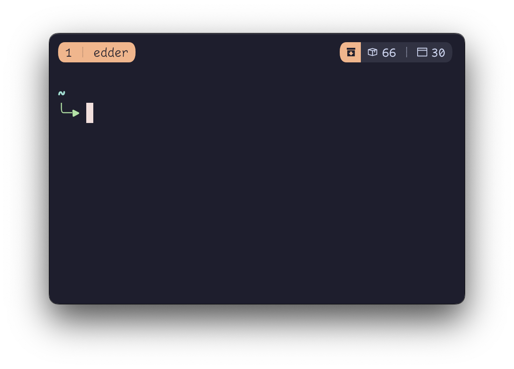

# brew-tmux: Homebrew package outdated status for brew-tmux

Script that displays [Homebrew](https://brew.sh) outdated packages for formulae and casks, heavily inspired from [kube-tmux](https://github.com/jonmosco/kube-tmux).

Mainly Made for [Catpuccin Tmux Theme](https://github.com/catppuccin/tmux).

## Requirements

- Tmux
- Homebrew
- jq
